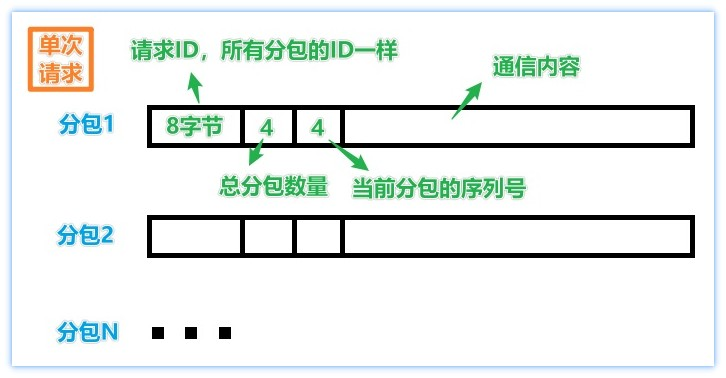
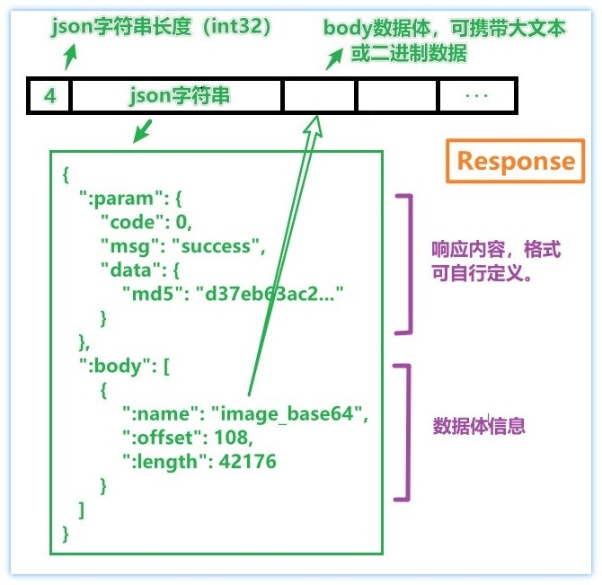

## UnixDomainSocket 进程间通信

目前仅支持`Linux`操作系统，之后考虑添加`Windows`系统的支持。


## 1. 简介

首先定义了`BaseClient`和`BaseServer`两个类，实现进程间数据(`std::string`)传输(`文本`、`二进制`均可)，使用的是`UDP`协议。

+ 进程`A`启动`BaseServer`作为服务端。
+ 进程`B`通过`BaseClient`向进程`A`发送数据。
+ `BaseServer`不能主动发送数据给`BaseClient`，但是可以在接收到数据后，返回响应数据(Response)。
+ 如果需要完全双向通信，需要两个进程都同时启用`BaseServer`和`BaseClient`。

在不超出机器物理内存限制的情况下，单次通信的数据大小不受限制。数据量较大时`BaseClient`会自动拆分多个包发送，`BaseServer`收到后会进行组包。

在此基础上，实现了基于`JSON`格式的`Client`和`Server`，功能上类似于`HTTP`协议的`POST`请求。通过`Router`路由功能，可以快速实现对不同请求路径的处理。


## 2. 性能

`BaseServer`的`QPS`可达`100,000+`，即每秒钟处理`10万`次请求并作出响应。


## 3. 项目结构

```txt
.
├── bin                          // 编译后的示例程序
├── example                      // 示例程序代码
│   ├── benchmark
│   ├── echo_server
│   ├── file_transfer
│   ├── simple_json_server
│   ├── uds_base_cli
│   └── uds_json_cli
├── lib
│   └── linux
│       ├── libjsoncpp.a              // jsoncpp静态库
│       └── release
│           ├── libuds_base.a         // src/uds/base编译生成的静态库
│           └── libuds_json.a         // src/uds/json编译生成的静态库
├── README.md
├── src
│   └── uds
│       ├── base
│       │   ├── base_client.cpp
│       │   ├── base_client.h        // 基础的客户端
│       │   ├── base_server.cpp
│       │   ├── base_server.h        // 基础的服务端
│       │   ├── error_code.cpp
│       │   ├── error_code.h         // 错误代码定义
│       │   └── impl                 // 实现类
│       │       └── ...
│       └── json      // 在src/uds/base基础上封装的基于json(可携带二进制数据)的通信
│           ├── client.cpp
│           ├── client.h
│           ├── message.cpp
│           ├── message.h
│           ├── request.cpp
│           ├── request.h
│           ├── response.cpp
│           ├── response.h
│           ├── router.cpp
│           ├── router.h
│           ├── server.cpp
│           └── server.h
├── third_party                     // 第三方库
│   └── jsoncpp
│       └── json
└── xmake.lua
```


## 4. `src/uds/base` 功能

分为两部分：

+ `BaseServer`: 服务端
+ `BaseClient`: 客户端

通信数据`不限制`大小，超过`64KB`会自动分包发送，服务端收到后会组包。



### 4.1 `BaseClient`

客户端发送数据给服务端，可以等待响应，也可以不等待响应。

```cpp
/**
 * @brief 仅发送数据，不等待服务器返回响应.
 * 
 * @param  data 待发送的数据
 * @param  ec 错误代码
 * @return 当前请求的ID
 * @note 通过 ec 判断是否成功
 */
int64_t Send(const std::string& data, std::error_code& ec);

/**
 * @brief 发送数据，等待服务器返回响应.
 * 
 * @param  data 待发送的数据
 * @param  response 服务器响应数据
 * @param  timeout_ms 超时时间，单位：毫秒
 * @param  ec 错误代码
 * @return 当前请求的ID
 * @note 通过 ec 判断是否成功
 */
int64_t SendRequest(const std::string& data, std::string* response, uint32_t timeout_ms, std::error_code& ec);
```


### 4.2 `BaseServer`

服务端设置请求回调函数。

```cpp
/**
 * @brief 接收到完成数据后的回调函数.
 */
using RequestCallback = std::function<void(
        BaseServer*        base_server,  /* 当前服务器指针 */
        const sockaddr_un& client_addr,  /* 来源客户端地址 */
        int64_t            request_id,   /* 请求ID，由客户端保证每次发送的请求ID是唯一的 */
        const std::string& data          /* 请求数据 */
    )>;
void set_request_callback(RequestCallback callback);
```

服务端处理请求后，调用`SendResponse(...)`函数返回响应。

```cpp
/**
 * @brief 返回给客户端响应数据.
 * 
 * @param client_addr 客户端地址
 * @param request_id 客户端的请求ID
 * @param data 响应内容
 */
bool SendResponse(const sockaddr_un& client_addr, int64_t request_id, const std::string& data);
```

参考`example/echo_server`目录下的示例代码。


## 5. `src/uds/json` 功能

实现类似于`HTTP`协议的`POST`请求功能。

协议格式：




### 5.1 `Request`和`Response`

命名空间`ic::uds`，二者都继承自`Message`基类。

+ `Client`发送`Request`，接收`Response`
+ `Server`接收`Request`，返回`Response`

### 5.2 `Client`

以`协议格式`中的请求为例：

```cpp
// 1. 创建请求
ic::uds::Request request("/image/Upload");
// 或 request.set_path("/image/Upload");

// 2. 设置请求参数(可选)
request["uid"] = 1001;
request["ext"] = "jpg";
request["overwrite"] = true;

// 3. 添加body数据体(可选)
request.AddBody("original_image", read_image("./image/original_image.jpg"));
request.AddBody("thumbnail", read_image("./image/thumbnail.jpg"));

// 4. 发送请求，并接收响应
auto response = client.SendRequest(request, 3000);

// 5. 查看响应内容
std::cout << "Response.status:  " << (int)response.status() << std::endl;
std::cout << "Response.message: " << response.message() << std::endl;
std::cout << "Response.content: " << fw.write(response.data()) << std::endl << std::endl;
```

### 5.3 `Router`和`Server`

以`协议格式`中的请求为例：


```cpp
// 1. 创建服务器
auto server = std::make_shared<ic::uds::Server>();

// 2. 初始化服务器
std::error_code ec;
server->Init("/dev/shm/server.sock", 4, ec);   // 线程池大小设为4
if (ec) {
    printf("[Error] UDS.Server init failed. %s\n", ec.message().c_str());
    return 1;
}

// 3. 定义路由
ic::uds::Router* router = server->router();
router->AddRoute("/image/Upload", "图片上传", [](ic::uds::Request& req, ic::uds::Response& res){
    // 3.1 读取请求参数
    int uid = req["uid"].asInt();
    std::string ext = req["ext"].asString();
    bool overwrite = req["overwrite"].asBool();

    // 3.2 读取数据体
    const std::string& original_image = req.GetBody("original_image"); /* 原始图片文件数据 */
    const std::string& thumbnail = req.GetBody("thumbnail"); /* 缩略图文件数据 */

    // 3.3 保存文件，计算md5，计算base64
    // ...

    // 3.4 返回响应
    res["code"] = 0;
    res["msg"] = "OK";
    res["data"]["md5"] = md5;
    res.body()["image_base64"] = image_base64;
});

// 4. 启动服务器
// 阻塞在这里，也可以通过std::thread放到其他线程启动
server->Start();
```

## 6. 更多示例请参考`example`目录下的代码


## 7. 鸣谢

+ [JsonCpp](https://github.com/open-source-parsers/jsoncpp)


## END

<leopard.c@outlook.com>
